# Lila and the Lantern Line

**Book One: The Season Bell**

This is an original story about a seven-year-old who lives in an ordinary seaside town and rides a magic tram to a cliff school. Hearthfolk keep the everyday world. Wickfolk live where small kindnesses make light. Nothing here is taken from another book or film. Book One is the whole first adventure, from the invitation to the ride home and back.

This page is the full script to vet. Each page has six panels. **Scene** is the picture. **Expressions** are faces and feelings. **Dialogue** is what people say, in words a seven-year-old can follow.

Pages 1–6 are drawn. Open the flip book from the hosted site at `lantern-line/index.html` to check the art style. On GitHub itself, this file is for reading the script, and the pictures for those six pages are shown below.

## People

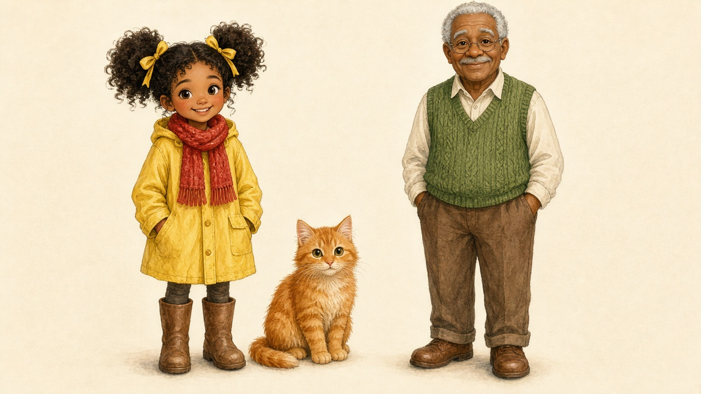

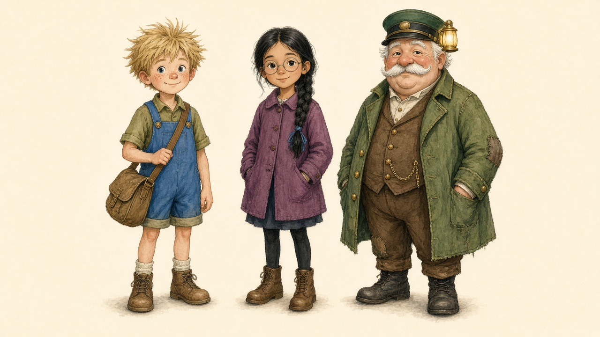

- **Lila Moss, 7.** Lives above a clock shop with Grandad. Warm medium-brown skin, dark curly hair in two puffs with yellow ribbons, yellow raincoat, red scarf. Curious, kind, and allowed to miss home.
- **Grandad Moss.** Repairs clocks and once rode the Lantern Line himself. Deep brown skin, silver hair, round glasses, green knitted vest. He tells the truth and expects Lila home at leaf-turn.
- **Biscuit.** The orange shop cat. He does not do magic. Love of him can visit as lamplight.
- **Pip Quinn, 7.** Freckles, sandy hair, blue jumper, a tin of marbles that roll toward people who need finding. Jokes first, then tells the truth.
- **Sera Voss, 7.** Long braid with a blue thread, round glasses, plum coat. Listens to plants and does not rush a sad friend.
- **Conductor Bramble.** Short and stout, moss-green patched coat, cap with a tiny lantern. Punches a star so children may ask questions.
- **Miss Wren.** Teacher at Wickermere. Teal dress, ink on her fingers. She keeps children safe and does not send them at a far problem on the first night.
- **Old Pell.** Groundskeeper. He wraps the bell because he is worried, not because he is cruel. He learns to read the mark he feared.

## World rules

- Hearthfolk live in ordinary towns. Wickfolk live where small lights are part of the day. A child can be both.
- The invitation is a paper swallow. It comes when a child mends something by wanting it well.
- The station is inside the town clock tower. The round door appears when both clock hands rest on the painted moon.
- The Lantern Line is a short greenhouse tram. Its lamps stay bright while the Season Bell is content.
- Wickermere is a cliff schoolhouse in an apple orchard, not a castle. Children may stand in lamp, loaf, leaf, or lore, and they may move the next day.
- The Season Bell rings for a true small kindness nearby. It is not a contest and not a weapon.
- Adults stay in the story. Children help, and they also eat breakfast.

## Chapters

- **A Quiet Bell** (pages 1–4). Lila finds a small light in an ordinary clock shop, gets a paper-bird invitation, and leaves with Grandad's blessing.
- **The Lantern Line** (pages 5–8). She meets Pip, Sera, and Conductor Bramble, rides the greenhouse tram, and arrives at a school whose trees cannot pick a season.
- **The Wrapped Bell** (pages 9–12). Old Pell has wrapped the Season Bell to protect a line he thinks is a crack. Three small kindnesses wake it.
- **Lessons for Small Lights** (pages 13–16). Letters fly both ways. Lessons stay small and honest. A far lamp flickers, and the adults say it can wait.
- **Staying Kind** (pages 17–20). Home-love visits as light. A sad day is allowed. Pell's apology becomes part of the bell's true note.
- **Leaf-turn** (pages 21–24). The children go home for a visit and choose to come back. A cousin bell down the coast is left for a later book.

## Page 1 — The Clock Shop

### Panel 1

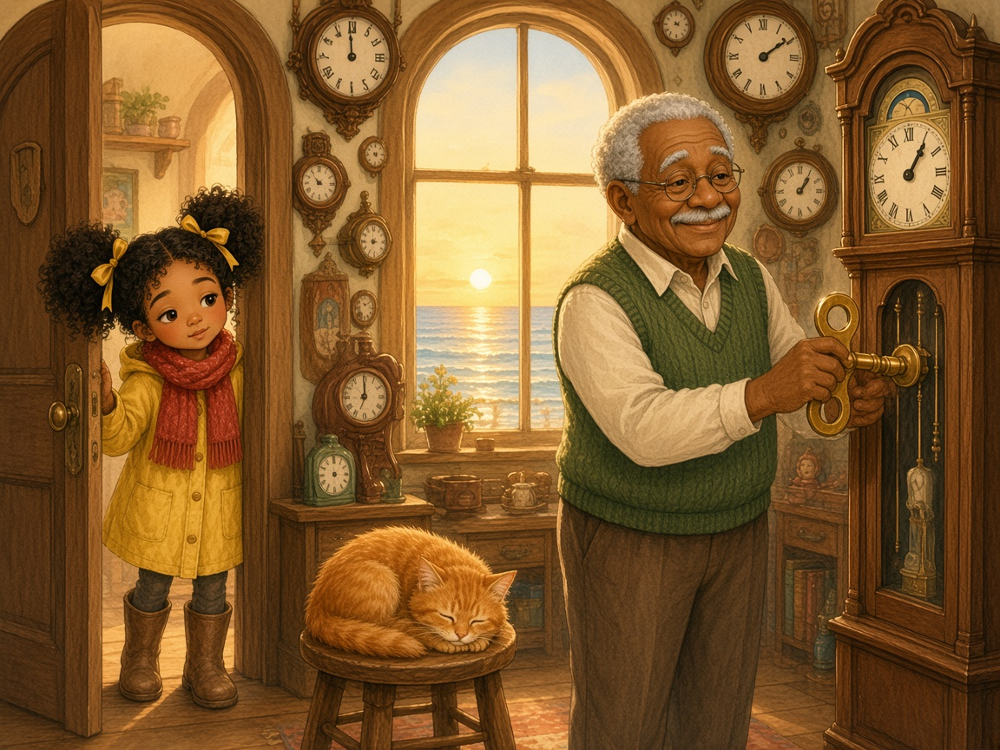

- **Scene:** A narrow seaside clock shop at sunrise. Brass clocks cover the walls. Sun comes through a wavy window. An orange cat sleeps on a stool. Lila peeks from the stair door. Grandad winds a tall clock.
- **Expressions:** Lila looks sleepy and curious. Grandad looks content and calm. The cat is fast asleep.
- **Dialogue:** **Lila:** “The big clock is humming.” **Grandad:** “Clocks do that when the day is ready.”

### Panel 2

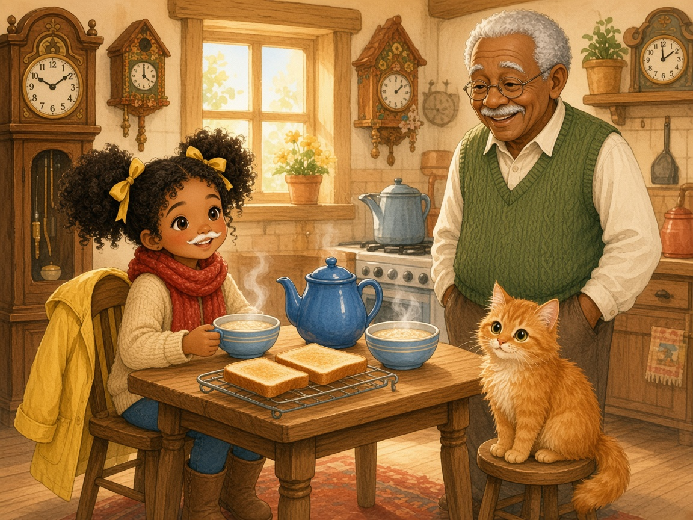

- **Scene:** The small kitchen behind the shop. Two bowls of porridge, a blue teapot, and toast cooling on a rack.
- **Expressions:** Lila smiles with a milk mustache. Grandad chuckles.
- **Dialogue:** **Grandad:** “Eat first. Wonders can wait.” **Lila:** “What if the wonder is in the porridge?”

### Panel 3

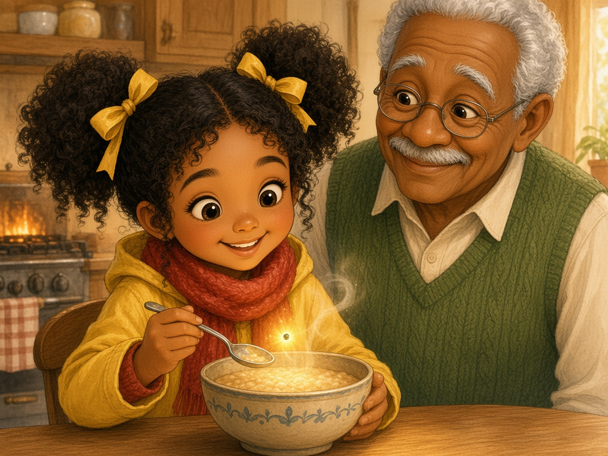

- **Scene:** Lila's spoon lifts a tiny warm glow, like a firefly, out of the porridge. The glow fades.
- **Expressions:** Lila's eyes go wide with delight, not fear. Grandad's eyebrows rise, then he gives a small knowing smile.
- **Dialogue:** **Lila:** “It winked at me.” **Grandad:** “Then wink back, and finish your bowl.”

### Panel 4

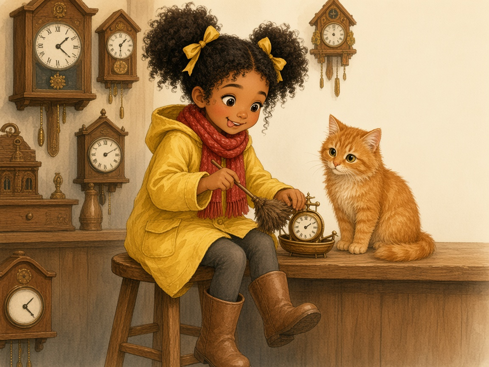

- **Scene:** Lila sits on a stool at the shop counter, feet swinging, dusting a tiny clock shaped like a boat.
- **Expressions:** She concentrates, tongue peeking out, then looks proud.
- **Dialogue:** **Lila:** “This one ticks like rain.”

### Panel 5

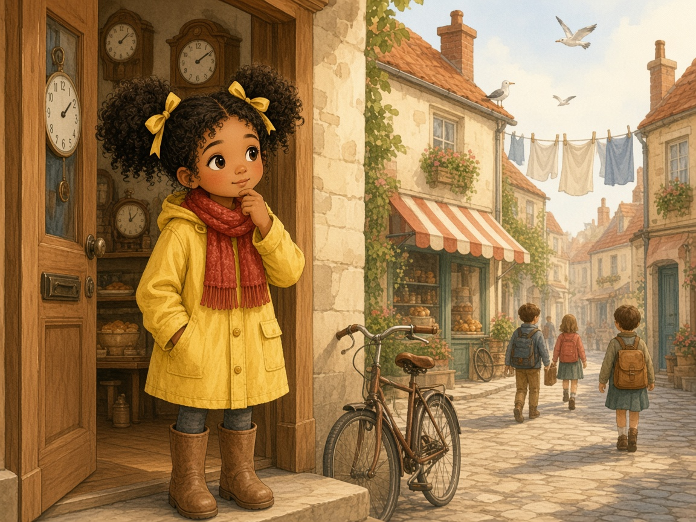

- **Scene:** Lila stands in the shop doorway. The ordinary street has a bakery, a bicycle, gulls, and laundry. Children walk to school with satchels.
- **Expressions:** Lila looks thoughtful and a little lonely.
- **Dialogue:** **Lila:** “Everyone else has a bell that tells them where to go.”

### Panel 6

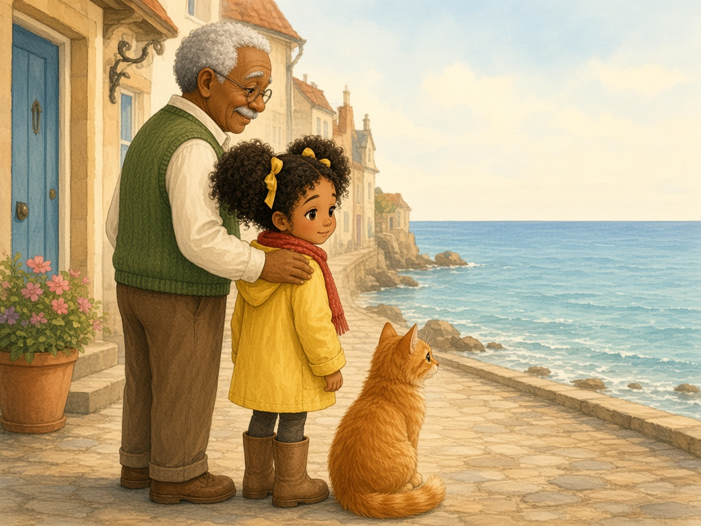

- **Scene:** Grandad rests a hand on Lila's shoulder. They look toward the sea at the end of the street.
- **Expressions:** Grandad looks tender. Lila leans into him.
- **Dialogue:** **Grandad:** “Your bell is just a quiet one. Quiet bells still call.”

## Page 2 — Small Glows

### Panel 7

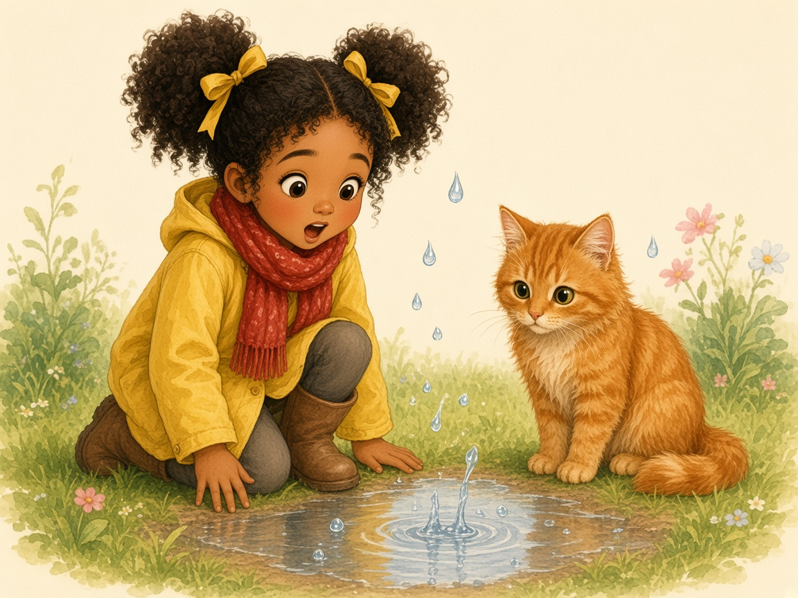

- **Scene:** The garden behind the shop. Rain falls up out of a puddle for a moment, then down again.
- **Expressions:** Lila kneels, mouth open in a happy O. The cat sits nearby, unbothered.
- **Dialogue:** **Lila:** “Grandad! The rain forgot which way is down.”

### Panel 8

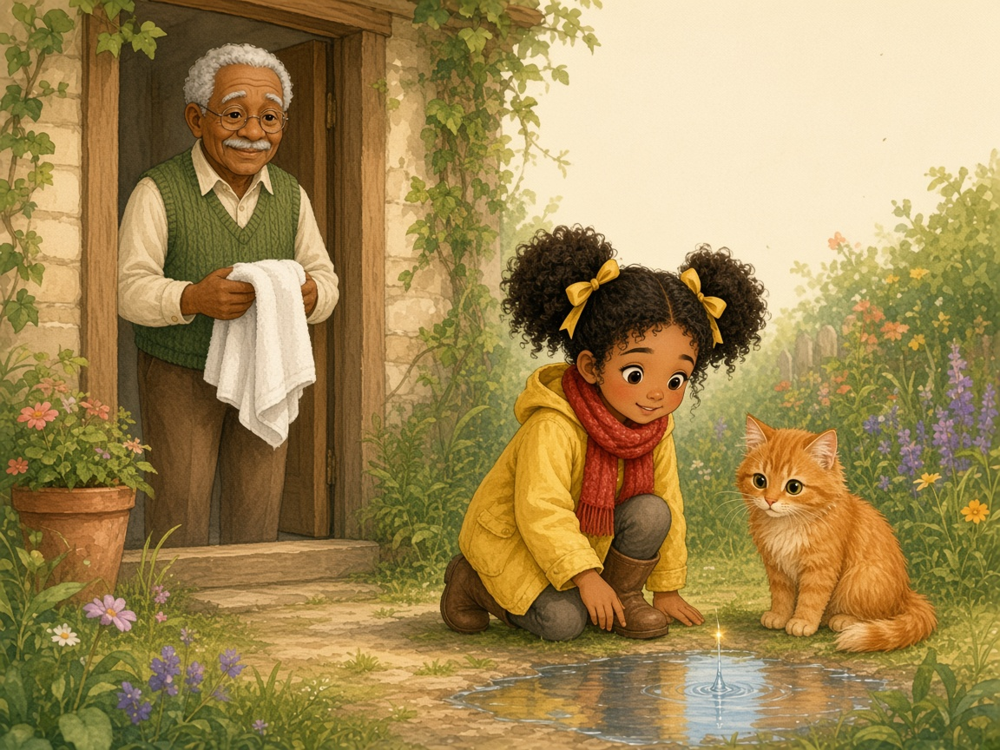

- **Scene:** Grandad stands in the doorway with a towel. The last drop falls upward and pops into a spark.
- **Expressions:** Grandad looks calm, fond, and a little wistful.
- **Dialogue:** **Grandad:** “It remembers you. That is all.”

### Panel 9

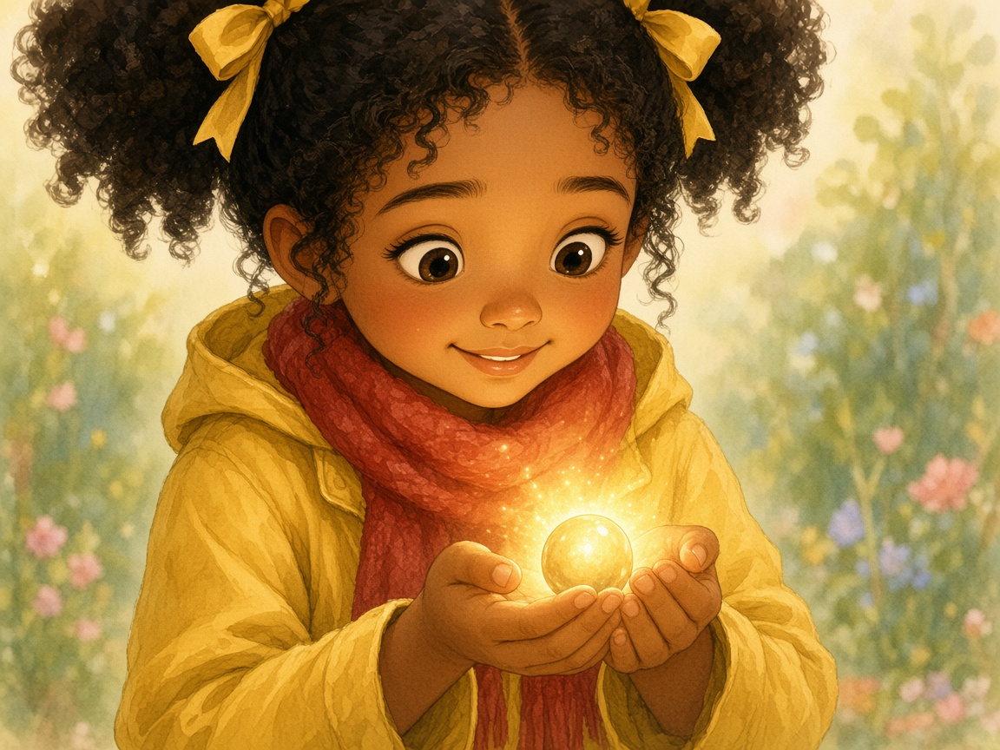

- **Scene:** Lila cups the spark. It sits in her palms like a warm marble of light.
- **Expressions:** Her face shows wonder. Her hands are careful. Her eyes shine.
- **Dialogue:** **Lila:** “It feels like a secret that likes me.”

### Panel 10

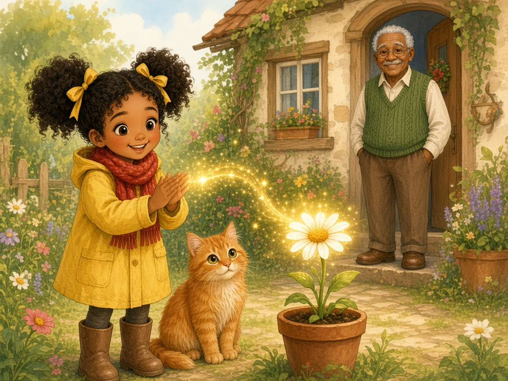

- **Scene:** The spark hops onto a drooping potted daisy, and the daisy stands up.
- **Expressions:** Lila is delighted. Grandad watches from the step, eyes shiny.
- **Dialogue:** **Grandad:** “You mended it by wanting it well. That is wick-magic.”

### Panel 11

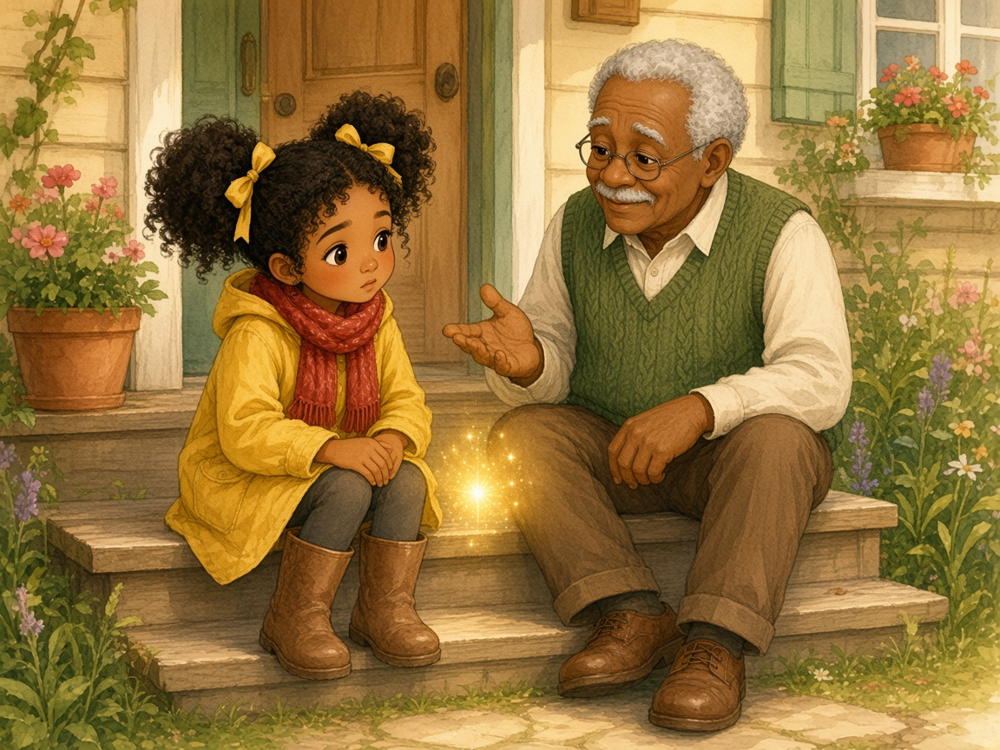

- **Scene:** Grandad and Lila sit together on the step. The spark rests between them.
- **Expressions:** Grandad looks serious but kind. Lila listens hard.
- **Dialogue:** **Grandad:** “Hearthfolk live in towns like ours. Wickfolk live where small lights are ordinary.”

### Panel 12

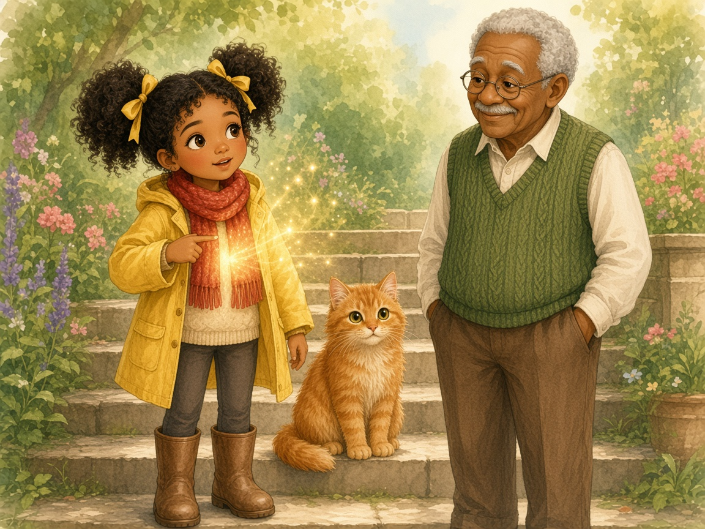

- **Scene:** Lila points at her chest. A faint warm glow shows under her open raincoat.
- **Expressions:** Lila looks hopeful. Grandad nods once.
- **Dialogue:** **Lila:** “Am I both?” **Grandad:** “You are Lila. And yes. You are invited, if you want to go.”

## Page 3 — The Swallow Letter

### Panel 13

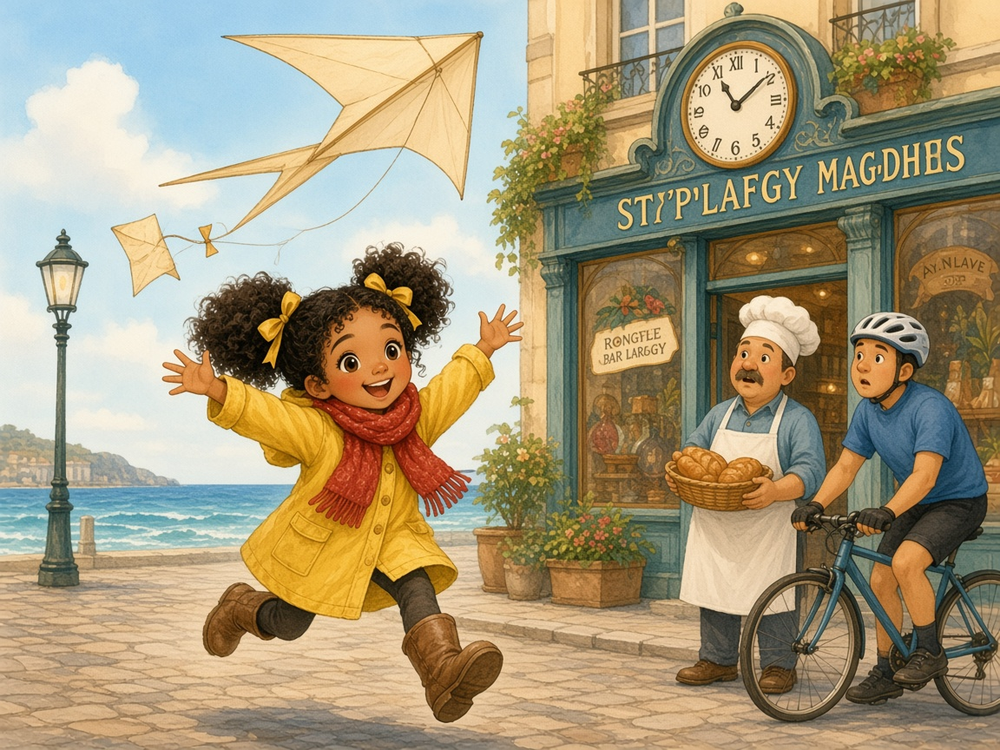

- **Scene:** A paper kite shaped like a swallow flies against the wind toward the shop. A cream letter is tied to its tail. A few townspeople look up.
- **Expressions:** The townspeople look mildly confused. Lila bounces, thrilled.
- **Dialogue:** **Lila:** “It is coming to our door on purpose!”

### Panel 14

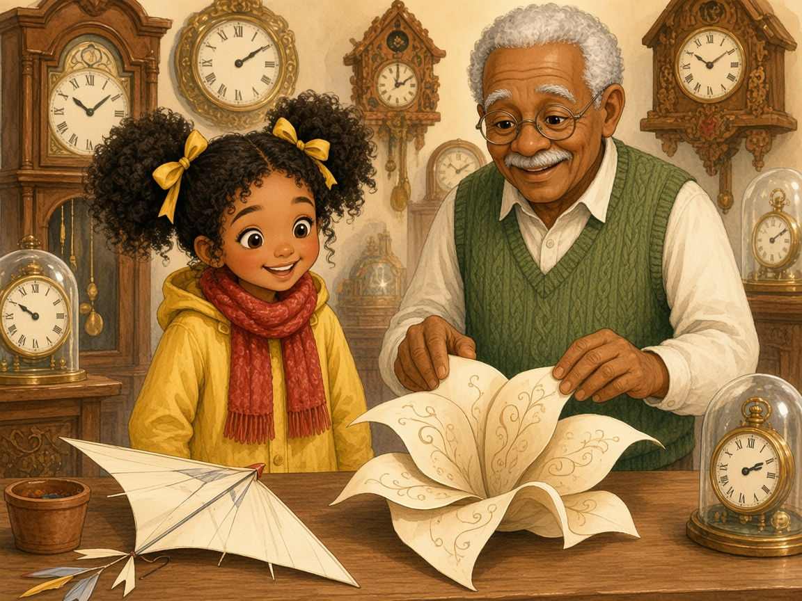

- **Scene:** The kite lands neatly on the counter. The letter unfolds by itself like a flower. The words are simple and large.
- **Expressions:** Lila looks reverent. Grandad's hands hover, respectful, not grabbing.
- **Dialogue:** **Letter:** “Lila Moss, the Lantern Line stops at the clock tower tonight. A seat is warmed for you.”

### Panel 15

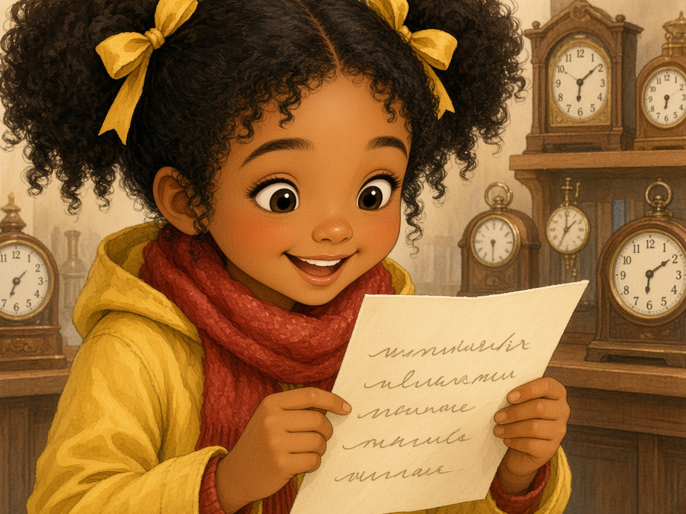

- **Scene:** Lila reads the letter, finger under the words.
- **Expressions:** Her lips move as she concentrates, then she breaks into a huge grin.
- **Dialogue:** **Lila:** “A seat. Warmed. For me.”

### Panel 16

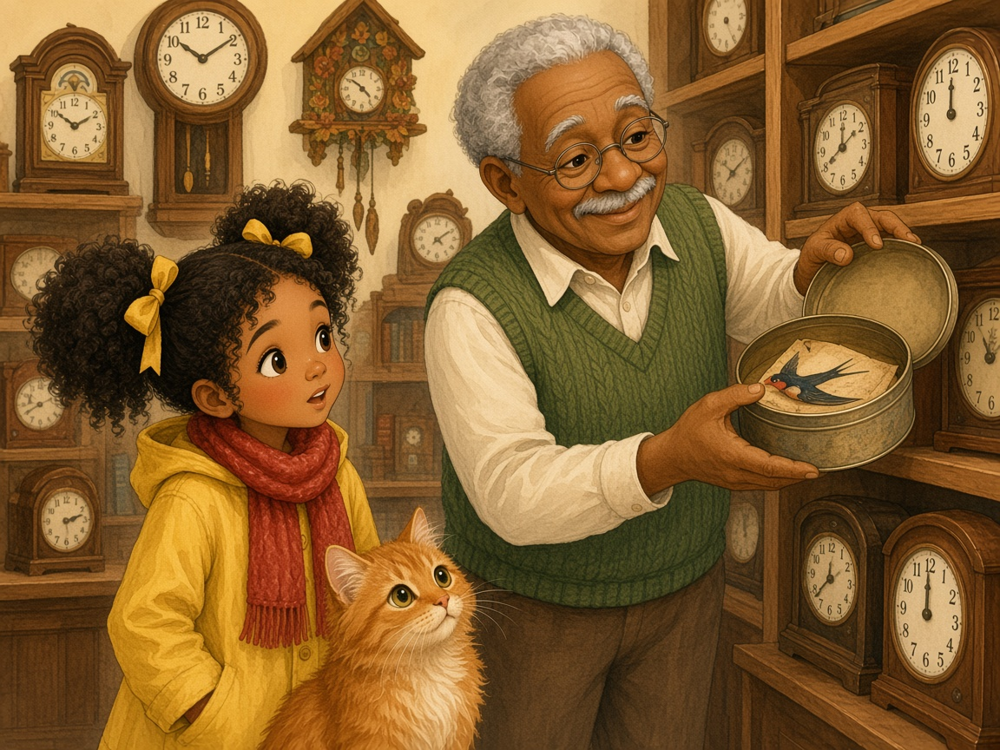

- **Scene:** Grandad opens a tin on a high shelf. Inside is his own old paper swallow, faded and folded flat.
- **Expressions:** Grandad looks nostalgic, with a soft smile. Lila looks surprised and proud of him.
- **Dialogue:** **Grandad:** “Mine came when I was seven too. I learned to listen to weather. Then I came home to fix clocks.”

### Panel 17

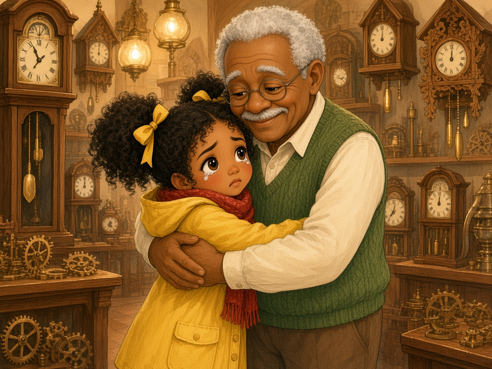

- **Scene:** Lila hugs Grandad around the middle in the shop.
- **Expressions:** Lila looks brave, with a little fear underneath. Grandad is steady, arms around her.
- **Dialogue:** **Lila:** “Will I come home?” **Grandad:** “At leaf-turn. And letters can fly both ways.”

### Panel 18

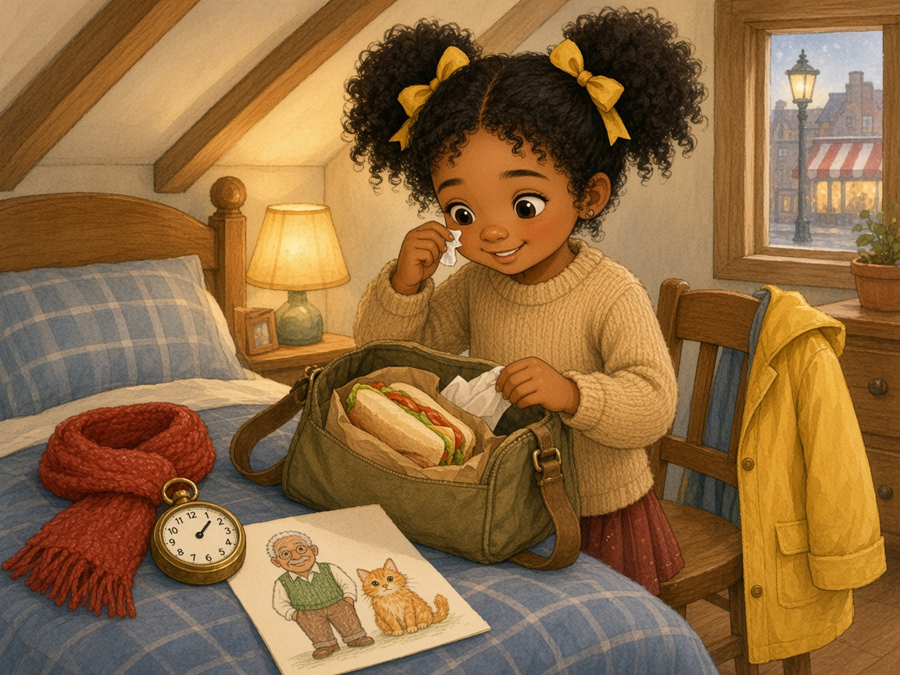

- **Scene:** Lila packs a small bag on her bed: her red scarf, a clock key, a sandwich, and a drawing of Grandad and the cat.
- **Expressions:** She looks determined, sniffs once, then smiles at the drawing.
- **Dialogue:** **Lila:** “I will tell the school about you, Biscuit.”

## Page 4 — The Moon Door

### Panel 19

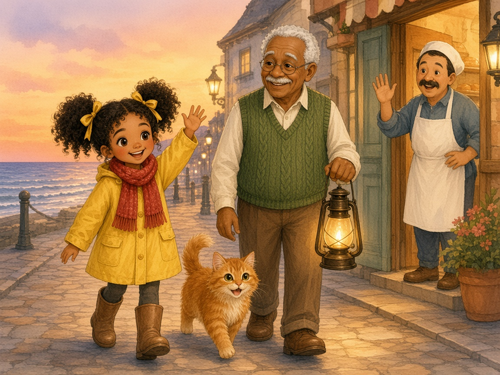

- **Scene:** Dusk on the street. Lila wears her yellow raincoat and red scarf. Grandad carries an ordinary oil lantern. They pass the bakery.
- **Expressions:** The baker waves, curious. Lila waves back, excited. Grandad looks peaceful.
- **Dialogue:** **Baker:** “Night fishing?” **Grandad:** “Something like fishing. We are catching a train.”

### Panel 20

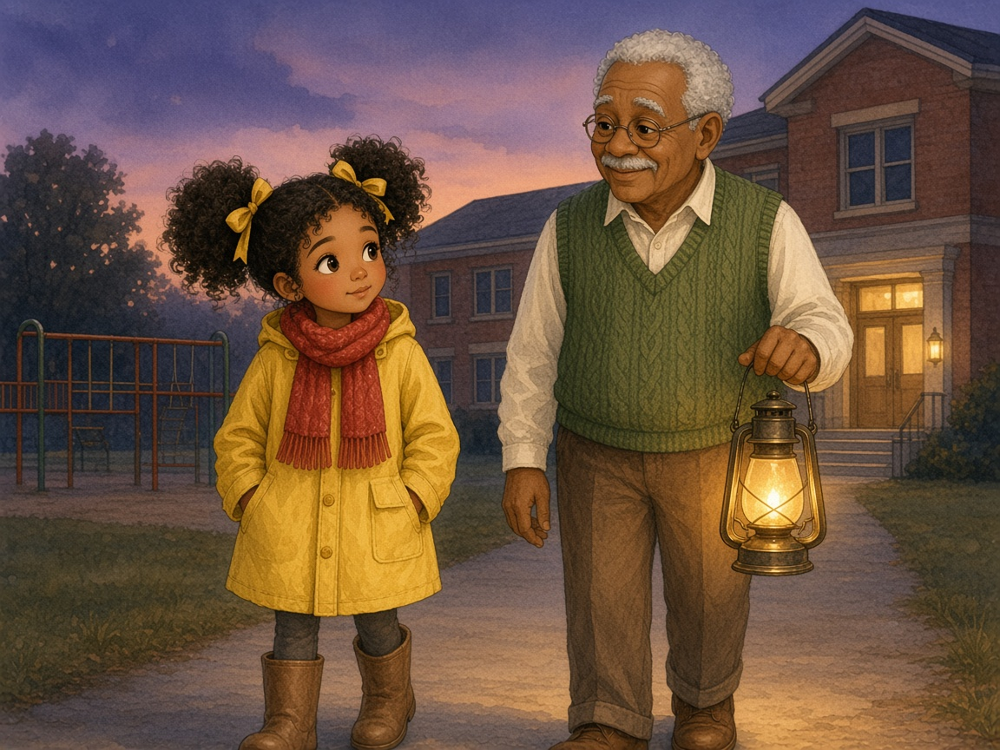

- **Scene:** They pass the ordinary school. The building is dark and quiet.
- **Expressions:** Lila glances at it, noticing, not sad. Grandad looks at her with pride.
- **Dialogue:** **Lila:** “Their bell is asleep.” **Grandad:** “Yours is waking.”

### Panel 21

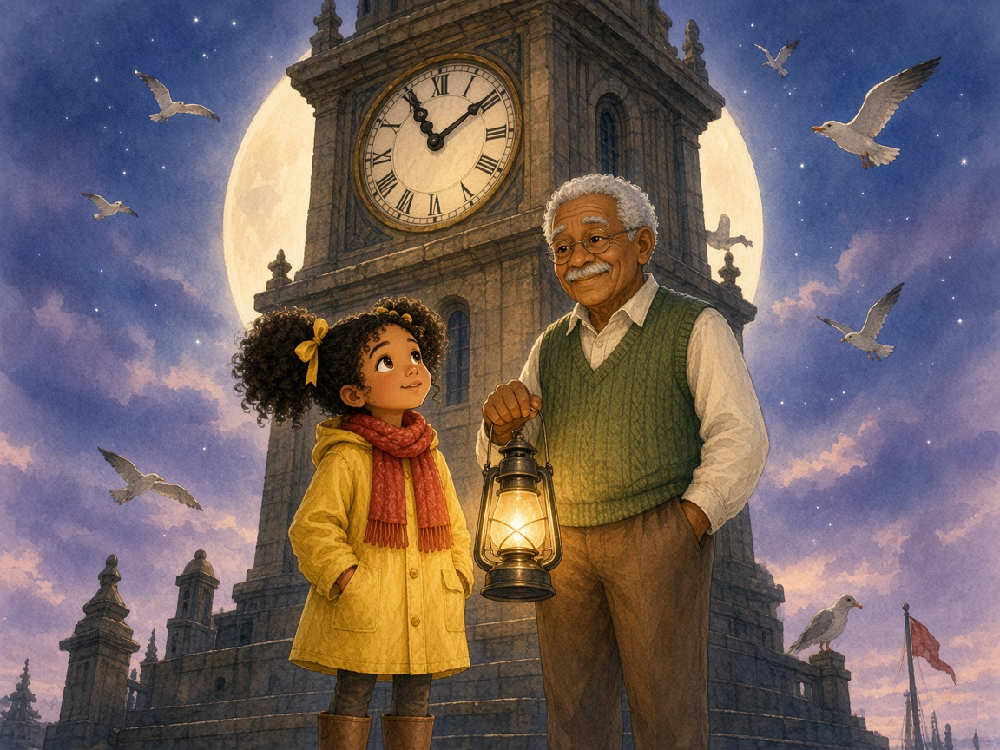

- **Scene:** The town clock tower stands at the end of the harbor. The moon rises behind it. Gulls settle.
- **Expressions:** Lila looks small and awed. The lantern lights both their faces warm.
- **Dialogue:** **Lila:** “It looks taller tonight.”

### Panel 22

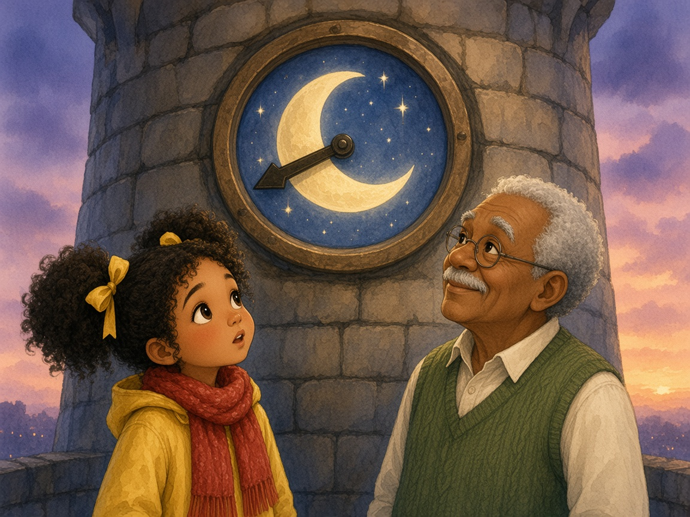

- **Scene:** Close on the clock face. A moon is painted near the center. Both clock hands slide until they rest together across that moon.
- **Expressions:** Lila holds her breath, eyes huge. Grandad counts softly, calm.
- **Dialogue:** **Grandad:** “When both hands rest on the moon, the door remembers.”

### Panel 23

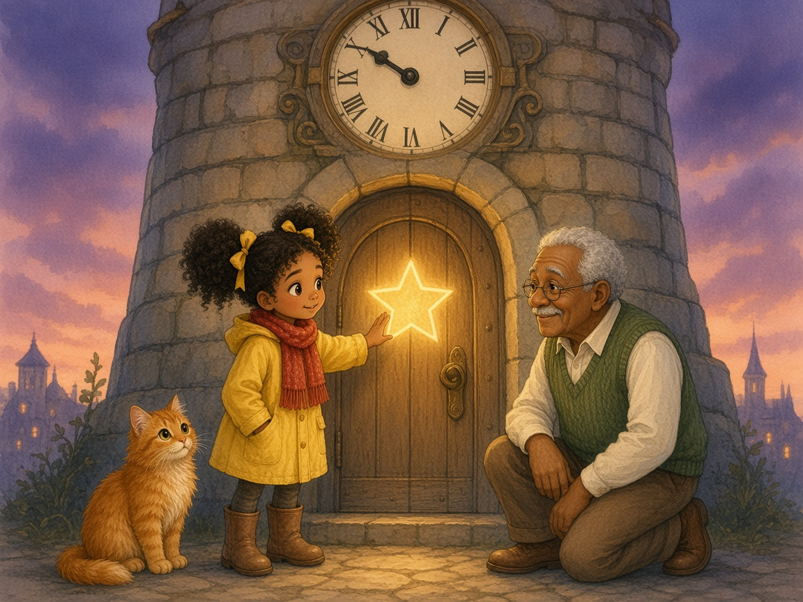

- **Scene:** A round, child-height wooden door draws itself in soft light on the tower stones. The handle is shaped like a star.
- **Expressions:** Lila reaches, hesitant and then brave. Grandad kneels so they are the same height.
- **Dialogue:** **Lila:** “Do I knock?” **Grandad:** “You may. It already knows your name.”

### Panel 24

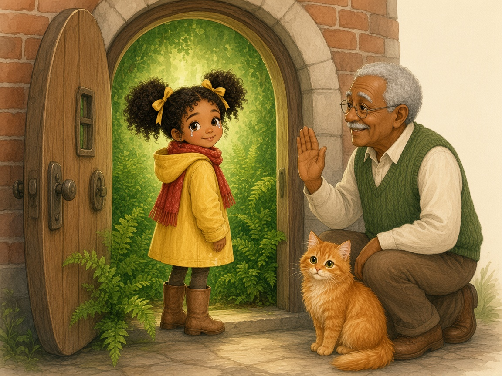

- **Scene:** Lila knocks. The door opens onto warm green light and the smell of wet ferns. Grandad stays outside.
- **Expressions:** Lila looks back, eyes wet and brave. Grandad smiles and raises one hand in a still wave.
- **Dialogue:** **Grandad:** “I will be at this moon again at leaf-turn.” **Lila:** “I will bring you a story.”

## Page 5 — The Fern Platform

### Panel 25

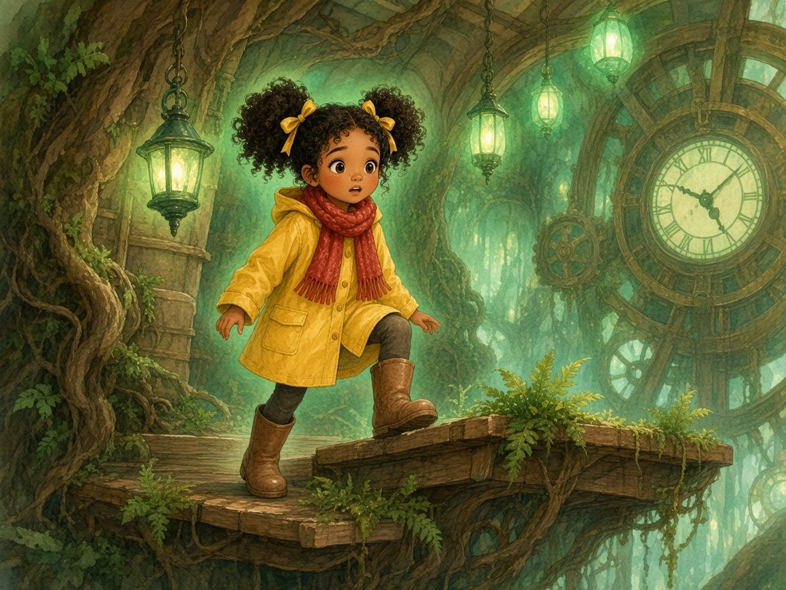

- **Scene:** Inside the tower is a small platform of ferns and wood. Lanterns hang from roots. A track is not there yet.
- **Expressions:** Lila steps in. Wonder replaces the fear. Her shoulders drop.
- **Dialogue:** **Lila:** “It smells like rain and toast.”

### Panel 26

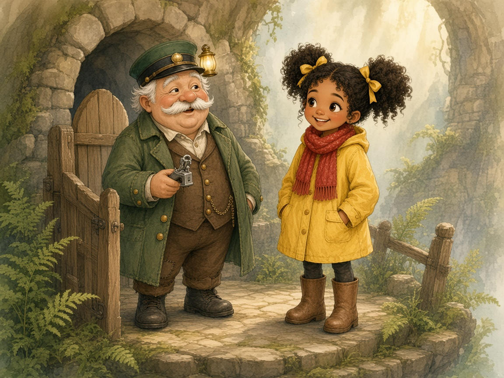

- **Scene:** Conductor Bramble stands by a little gate in a moss-green patched coat and a cap with a tiny lantern. He holds a ticket punch.
- **Expressions:** Bramble's eyes crinkle in welcome. Lila is shy, then grins.
- **Dialogue:** **Bramble:** “Lila Moss. I kept your seat away from the draft.” **Lila:** “Thank you. I am seven.”

### Panel 27

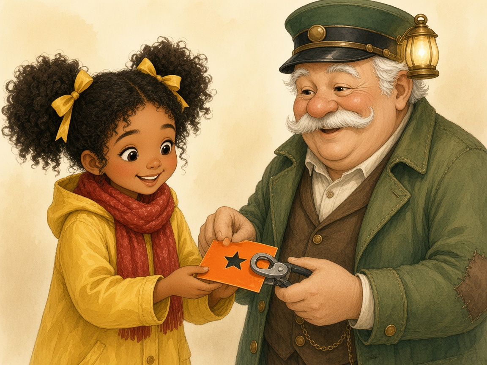

- **Scene:** Bramble punches a star-shaped hole in a honey-colored ticket and hands it to Lila.
- **Expressions:** Lila studies the ticket like treasure. Bramble looks proud of his punch.
- **Dialogue:** **Bramble:** “A star-hole means you may ride, and you may ask questions.”

### Panel 28

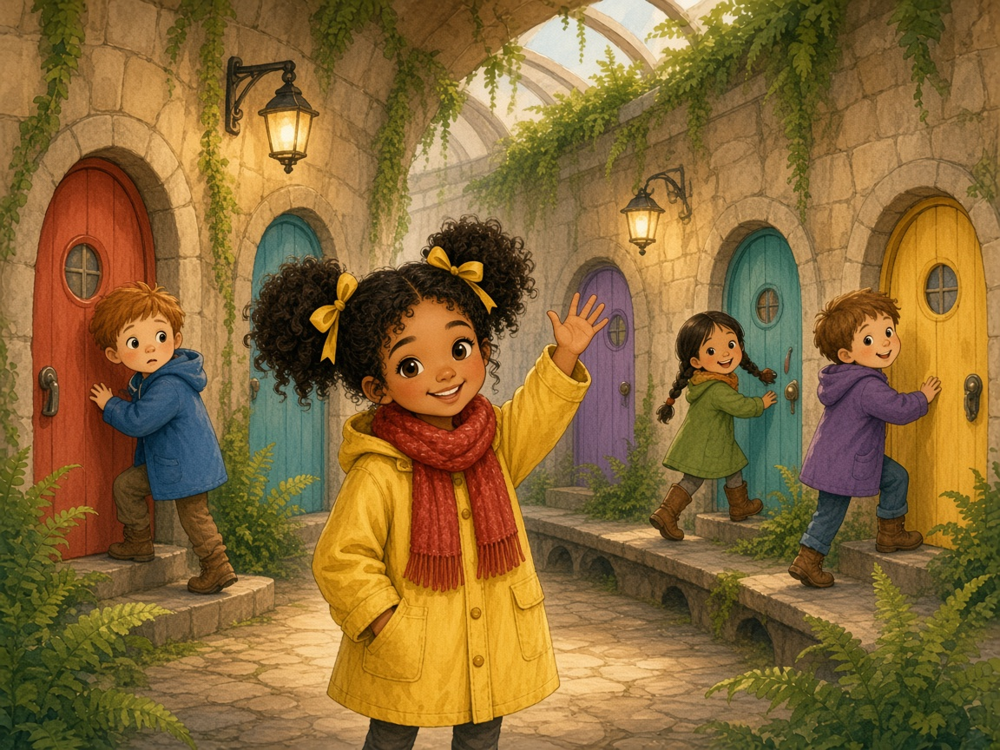

- **Scene:** A few other children step out of small round doors of different colors in the tower wall.
- **Expressions:** Some children look nervous and some bounce. Lila lifts a small hello.
- **Dialogue:** **Lila:** “Hello. I am new too, if you are new.”

### Panel 29

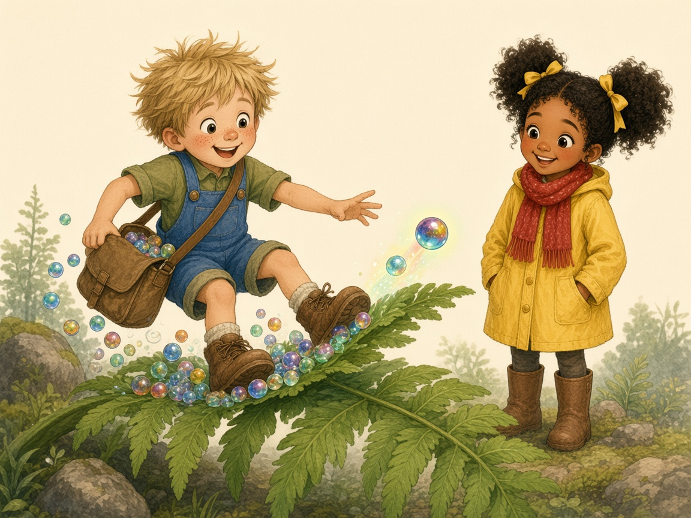

- **Scene:** Pip Quinn skids in. Marbles spill. One marble rolls uphill back into his hand.
- **Expressions:** Pip looks embarrassed, then delighted. Lila laughs kindly.
- **Dialogue:** **Pip:** “They do that when I am late.” **Lila:** “Then they are good marbles.”

### Panel 30

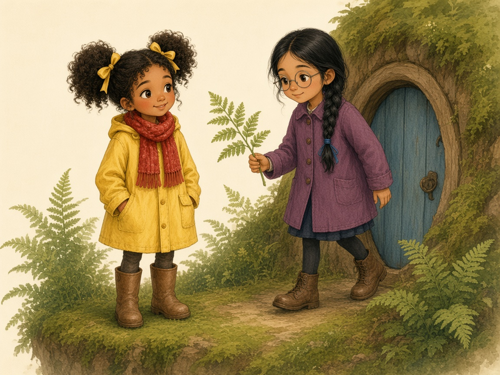

- **Scene:** Sera Voss steps through a blue door, braid over her shoulder, holding a sprig that leans toward Lila.
- **Expressions:** Sera gives a quiet small smile. Lila looks curious and gentle.
- **Dialogue:** **Sera:** “The sprig likes your coat.” **Lila:** “My coat likes your sprig.”

## Page 6 — All Aboard

### Panel 31

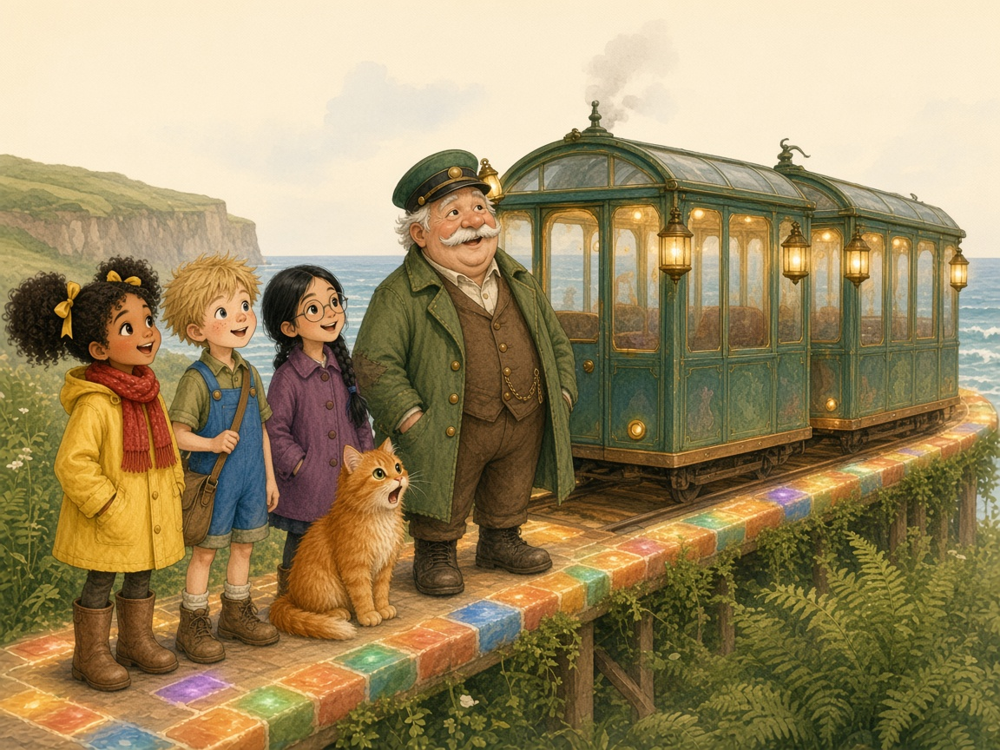

- **Scene:** A whistle like a kettle sounds. A short tram arrives: three carriages like greenhouses, lanterns at the corners, no smoke. Glowing bricks appear under the wheels.
- **Expressions:** Lila, Pip, and Sera are lit gold, mouths open in joy. Bramble looks pleased.
- **Dialogue:** **Bramble:** “Greenhouse cars. Mind the leaves. They like to wave.”

### Panel 32

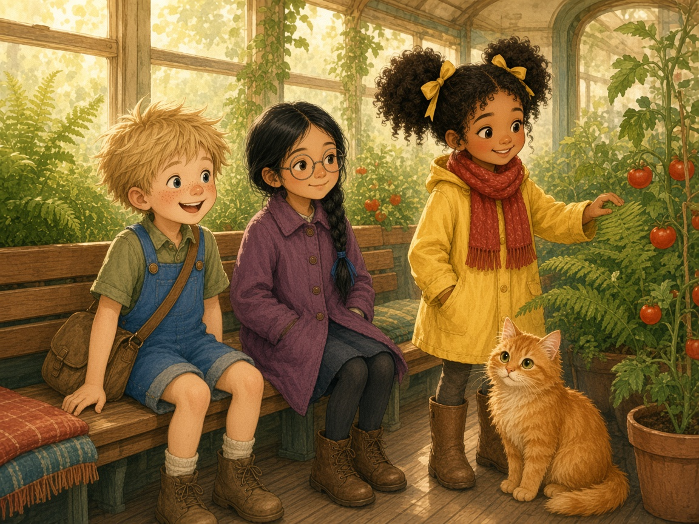

- **Scene:** They climb aboard. The seats are wooden benches with blankets. Tomato vines and ferns grow along the windows.
- **Expressions:** Pip bounces once, then sits on his hands to be polite. Sera is careful. Lila pats a fern hello.
- **Dialogue:** **Pip:** “Are we allowed to be this happy?” **Lila:** “I think that is the ticket.”

### Panel 33

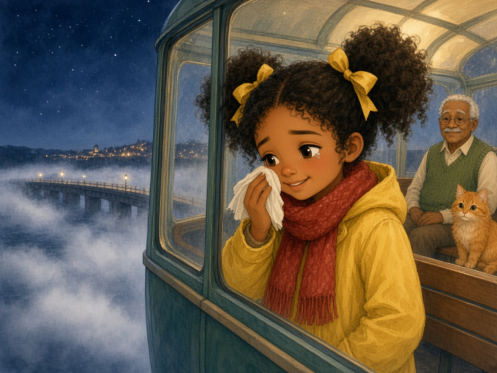

- **Scene:** The tram rolls out of the tower onto a low bridge of fog over the night sea. The town lights behind them look small and dear.
- **Expressions:** Lila presses her face softly to the glass. She misses Grandad and is still excited. She wipes one tear and smiles.
- **Dialogue:** **Lila:** “Goodnight, clock shop.”

### Panel 34

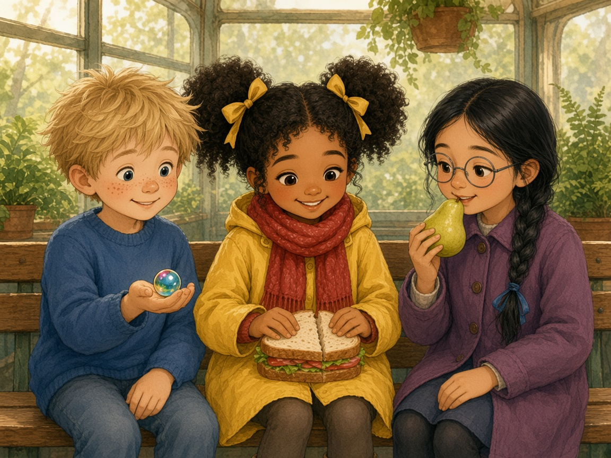

- **Scene:** Inside the carriage, Pip offers a marble, Sera offers a bite of pear, and Lila breaks her sandwich into three.
- **Expressions:** All three look shy, then easy. A friendship is starting.
- **Dialogue:** **Lila:** “Sharing makes it taste bigger.” **Sera:** “That is true at my house too.”

### Panel 35

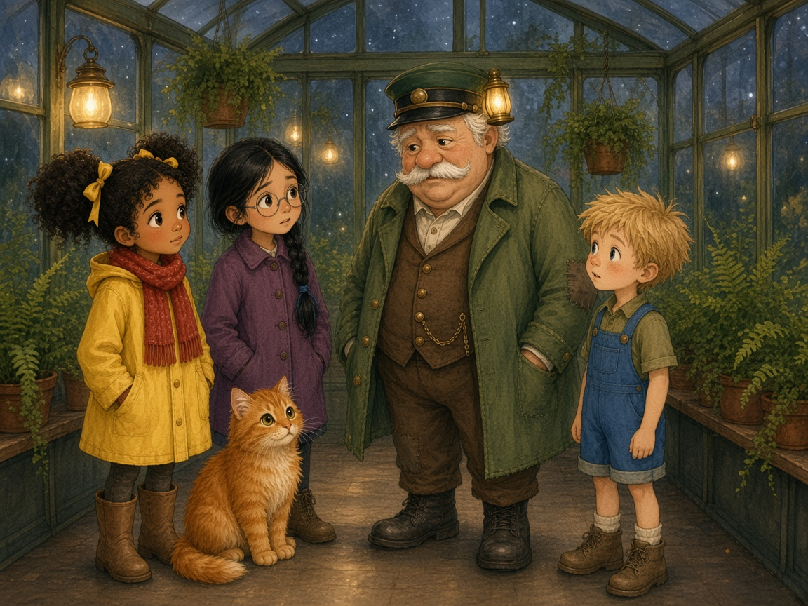

- **Scene:** A corner lantern flickers and goes dim. The ferns droop a little.
- **Expressions:** Bramble's smile slips into a worry he tries to hide. The children notice. Lila looks alert and caring.
- **Dialogue:** **Bramble:** “Do not fret. The lamps are only thirsty.” **Lila:** “Thirsty for what?”

### Panel 36

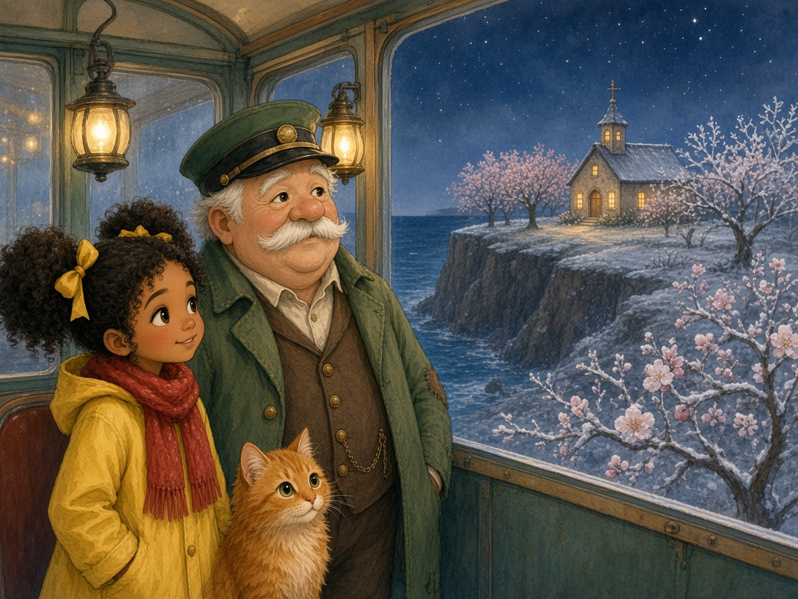

- **Scene:** Through the front glass, a small stone schoolhouse sits on a sea cliff among apple trees. Some branches wear frost and pink blossom at the same time. The tram lanterns glow weaker.
- **Expressions:** The children look awed and a little uneasy. Bramble looks kind but concerned. Lila lifts her chin, ready.
- **Dialogue:** **Bramble:** “That is Wickermere. The Season Bell should have lit our lamps by now.” **Lila:** “Then we will go and listen to it.”

## Page 7 — The Mixed-up Trees

### Panel 37

*Art not drawn yet.*

- **Scene:** The tram stops at a wooden gate in a stone wall. Beyond it, apple trees hold blossom and frost together. A path of round stones leads in.
- **Expressions:** Lila steps down, brave. Pip clutches his satchel. Sera breathes in, calm.
- **Dialogue:** **Pip:** “It is pretty and a bit mixed up.” **Sera:** “The trees cannot pick a season.”

### Panel 38

*Art not drawn yet.*

- **Scene:** Miss Wren waits at the gate in a teal dress, her hair in a bun. Her lantern is steady, unlike the tram's.
- **Expressions:** Miss Wren's smile is warm and steady. The children look up.
- **Dialogue:** **Miss Wren:** “I am Miss Wren. You are safe, and you are wanted.”

### Panel 39

*Art not drawn yet.*

- **Scene:** Miss Wren kneels to their height and looks at the dim lantern in Bramble's hands.
- **Expressions:** Miss Wren is concerned, not afraid. Bramble looks as if the train has let someone down. Lila watches them both.
- **Dialogue:** **Miss Wren:** “The bell has been quiet for three days.” **Bramble:** “The Line feels it.”

### Panel 40

*Art not drawn yet.*

- **Scene:** Close on one branch: an apple blossom, a tiny green apple, and frost crystals, all together.
- **Expressions:** Lila's finger stays back, respectful. Her face is thoughtful.
- **Dialogue:** **Lila:** “The tree is trying to be every day at once. That seems tiring.”

### Panel 41

*Art not drawn yet.*

- **Scene:** Miss Wren nods, still kneeling by the branch.
- **Expressions:** Miss Wren's eyes are kind and bright. Lila looks a little shy at being right.
- **Dialogue:** **Miss Wren:** “That is a good way to say it. Tired trees need a gentle bell, not a loud one.”

### Panel 42

*Art not drawn yet.*

- **Scene:** The children walk the stone path. A grey cat with a silent bell on its collar leads them. The schoolhouse windows are warm.
- **Expressions:** Pip whispers to the cat. Sera smiles. Lila says hello the way she does at home.
- **Dialogue:** **Pip:** “Even the cat bell is shy.” **Miss Wren:** “Old Pell wrapped the big bell. He was trying to help.”

## Page 8 — Lamp, Loaf, Leaf, Lore

### Panel 43

*Art not drawn yet.*

- **Scene:** A round wooden hall. Four circles are painted on the floor: a lamp, a loaf, a leaf, and an open book. Children already there sit where they like, mixed together.
- **Expressions:** The new children look curious. The older children, still young, smile welcomes.
- **Dialogue:** **Miss Wren:** “You may stand in lamp, loaf, leaf, or lore. You may move tomorrow if you wish.”

### Panel 44

*Art not drawn yet.*

- **Scene:** Pip stands on the loaf circle. Sera stands on the leaf circle. Lila stands between them, not chosen yet.
- **Expressions:** Pip looks proud and hungry for the idea. Sera looks peaceful. Lila thinks, finger on her chin.
- **Dialogue:** **Pip:** “Loaf. I am very good at second helpings.” **Sera:** “Leaf. The sprig told me to.”

### Panel 45

*Art not drawn yet.*

- **Scene:** Lila steps onto the lamp circle. Her palms give a small warm glow that fades.
- **Expressions:** She looks surprised at herself, then pleased. Miss Wren nods.
- **Dialogue:** **Lila:** “Lamp. I want to learn why lights go thirsty.”

### Panel 46

*Art not drawn yet.*

- **Scene:** A welcome supper at long tables: apple slices, bread, and milk. Children talk. Lila holds up her ticket.
- **Expressions:** Mouths are full. Faces are polite and happy.
- **Dialogue:** **Lila:** “The hole is a star so we may ask questions.” **Pip:** “I have nine questions and one spare.”

### Panel 47

*Art not drawn yet.*

- **Scene:** A night loft with three small beds and blankets in lamp-gold, loaf-brown, and leaf-green. The window shows the mixed orchard under the moon.
- **Expressions:** They are in pajamas and sleepy. Lila sits up. Pip is already a lump. Sera brushes her braid.
- **Dialogue:** **Sera:** “Do you miss someone?” **Lila:** “Grandad. And Biscuit the cat. I can miss them and still like it here.”

### Panel 48

*Art not drawn yet.*

- **Scene:** Lila stands at the loft window. Far off, the bell arch on the cliff is dark. A cloth-wrapped shape hangs inside it.
- **Expressions:** Lila's face is determined and soft, like a promise, not a sneaky plan.
- **Dialogue:** **Lila:** “Tomorrow we listen. We do not poke a tired thing.”

## Page 9 — The Wrapped Bell

### Panel 49

*Art not drawn yet.*

- **Scene:** Morning mist on the cliff path. Miss Wren hands Lila a small unlit loan-lamp. Pip and Sera carry a basket.
- **Expressions:** Miss Wren looks trusting. Lila holds the lamp carefully. Pip and Sera look ready.
- **Dialogue:** **Miss Wren:** “Look, and be kind. If Pell is gruff, it is because he is worried, not because he is unkind.”

### Panel 50

*Art not drawn yet.*

- **Scene:** The bell arch. A large bronze bell is wrapped in many knitted scarves. Old Pell sits on a stool with arms folded.
- **Expressions:** Pell's eyes are tired. His mouth is soft even while he tries to look firm. The children are polite, not scared.
- **Dialogue:** **Pell:** “No poking. It has a crack. I will not let the sea wind make it worse.”

### Panel 51

*Art not drawn yet.*

- **Scene:** Lila does not touch the bell. She sits on the ground so she is lower than Pell and looks up.
- **Expressions:** Lila looks respectful. Pell's shoulders drop a little.
- **Dialogue:** **Lila:** “My grandad wraps clocks when they are scared of dust. May we just look?”

### Panel 52

*Art not drawn yet.*

- **Scene:** Pell sighs and lifts the edge of one scarf. Under it, a dark line shows on the bronze.
- **Expressions:** Pell's face crumples with care. The children lean in, concerned.
- **Dialogue:** **Pell:** “There. A crack. If it rings, I fear it will split.”

### Panel 53

*Art not drawn yet.*

- **Scene:** Sera tilts her head. The line is perfectly straight and ends in a tiny painted leaf.
- **Expressions:** Sera looks thoughtful, almost smiling. Pell looks confused. Pip squints.
- **Dialogue:** **Sera:** “Cracks are wiggly. This line is tidy. It has a leaf at the end.”

### Panel 54

*Art not drawn yet.*

- **Scene:** Lila points, still not touching. The painted leaf is clear at the end of the line.
- **Expressions:** Lila looks certain and gentle. Pell looks startled. Hope fights with worry on his face.
- **Dialogue:** **Lila:** “That is a lesson mark. Someone painted it. The bell is not broken.”

## Page 10 — Not a Crack

### Panel 55

*Art not drawn yet.*

- **Scene:** Pell sits down hard on the stool, scarves in his lap.
- **Expressions:** Pell's eyes are wet, and he wears a small embarrassed smile. The children do not laugh at him. Pip's hand rests on Pell's sleeve.
- **Dialogue:** **Pell:** “I hid a well bell. I am sorry.” **Pip:** “You were brave to guard it. Even if it did not need a guard.”

### Panel 56

*Art not drawn yet.*

- **Scene:** They unwrap the bell together and fold the scarves neatly. The bronze is whole and dull, not glowing.
- **Expressions:** Careful hands. Teamwork faces. Pell looks grateful.
- **Dialogue:** **Sera:** “It is quiet, but it is whole.”

### Panel 57

*Art not drawn yet.*

- **Scene:** Lila holds up the loan-lamp and wishes hard. It does not light.
- **Expressions:** Lila puffs her cheeks in frustration, then lets the puff go. The others wait.
- **Dialogue:** **Lila:** “Wishing loud is not the same as mending.”

### Panel 58

*Art not drawn yet.*

- **Scene:** Pip taps the bell very softly with a marble. It makes a clunk and does not ring.
- **Expressions:** Pip winces, sorry. Pell shakes his head, not angry.
- **Dialogue:** **Pip:** “Sorry. Marbles are not music.” **Pell:** “No harm. It does not want noise.”

### Panel 59

*Art not drawn yet.*

- **Scene:** Miss Wren arrives with a tray of tea and sits on the low wall, as if she knew they would be here.
- **Expressions:** Miss Wren looks calm and proud that they asked. The children look to her.
- **Dialogue:** **Miss Wren:** “The Season Bell rings when a true small kindness happens beside it. Not a show. A real one.”

### Panel 60

*Art not drawn yet.*

- **Scene:** Pell, Miss Wren, and the three children look at one another. Lila's eyes move to Pip's satchel.
- **Expressions:** They look thoughtful and a little stuck, then a small idea starts.
- **Dialogue:** **Lila:** “Then we should not perform. We should notice who needs a small true thing.”

## Page 11 — Three True Things

### Panel 61

*Art not drawn yet.*

- **Scene:** On the path, a tiny student about six searches the grass, upset.
- **Expressions:** The small child is near tears. Pip's jokey face turns serious and kind.
- **Dialogue:** **Tiny student:** “My blue marble. It finds me when I am lost. Now it is lost.”

### Panel 62

*Art not drawn yet.*

- **Scene:** Pip kneels, opens his tin, and holds out his favorite blue marble.
- **Expressions:** Pip's smile is wobbly but real. He is giving something he loves. The tiny student's face lights up.
- **Dialogue:** **Pip:** “This one rolls home. It can be yours. I have others.”

### Panel 63

*Art not drawn yet.*

- **Scene:** The marble rolls from Pip's palm into the child's hand by itself.
- **Expressions:** Both children laugh. Lila and Sera watch with soft eyes.
- **Dialogue:** **Tiny student:** “It likes you still.” **Pip:** “It can like us both.”

### Panel 64

*Art not drawn yet.*

- **Scene:** Sera kneels by a frost-burned seedling. Its leaves are curled.
- **Expressions:** Sera looks tender and whispers. The leaves turn toward her.
- **Dialogue:** **Sera:** “You do not have to bloom and freeze today. Just be a small green thing.”

### Panel 65

*Art not drawn yet.*

- **Scene:** Sera loosens the blue thread from her braid, ties a tiny wind shield, and pours a sip of her water on the roots.
- **Expressions:** Sera is focused and gentle. Her braid is a little messy. The seedling stands up a fraction.
- **Dialogue:** **Sera:** “There. A sip and a scarf. Same as Pell, but smaller.”

### Panel 66

*Art not drawn yet.*

- **Scene:** Lila breaks the last of her home sandwich and gives half to Pell, who forgot breakfast.
- **Expressions:** Pell looks surprised and moved. Lila is matter-of-fact, not proud of herself.
- **Dialogue:** **Lila:** “Grandad says worry is hungry. This has butter.” **Pell:** “It tastes like a hearth.”

## Page 12 — The Bell Remembers

### Panel 67

*Art not drawn yet.*

- **Scene:** The three kindnesses happened away from the bell. The children walk back along the cliff. The sky is ordinary.
- **Expressions:** They look hopeful, not like they expect fireworks. Their faces are quiet.
- **Dialogue:** **Lila:** “If it did not see us, that is all right. The kindness still happened.”

### Panel 68

*Art not drawn yet.*

- **Scene:** At the arch, the unwrapped bell gives a thin warm sound, like a spoon on a cup.
- **Expressions:** Everyone goes still. Eyes widen. Smiles grow slowly. Pell's hand covers his mouth.
- **Dialogue:** **Pell:** “It heard anyway.”

### Panel 69

*Art not drawn yet.*

- **Scene:** A thread of gold light travels from the bell down the cliff path and into the tram lanterns. Each lantern pops awake. Bramble, small in the distance, throws his cap in the air.
- **Expressions:** The children cheer quietly, as if not to scare the light.
- **Dialogue:** **Bramble:** “They are drinking! The lamps are drinking!”

### Panel 70

*Art not drawn yet.*

- **Scene:** The orchard seems to breathe out. Frost melts into dew. Blossoms settle into a few early apples. The season becomes early autumn.
- **Expressions:** The trees look restful. The children laugh and spin once. Miss Wren's eyes close, content.
- **Dialogue:** **Miss Wren:** “Early autumn. A fine season for beginners.”

### Panel 71

*Art not drawn yet.*

- **Scene:** Supper in the hall: apple tarts, bread, and pears. Pell gets the first slice and looks shy. Pip gets the second and does not look shy.
- **Expressions:** Crumbs, joy, and belonging. A faint happy glow shows in Lila's palms.
- **Dialogue:** **Pip:** “Second helpings are a kind of kindness.” **Miss Wren:** “Sometimes.”

### Panel 72

*Art not drawn yet.*

- **Scene:** Night in the loft. Lila folds a new paper swallow at the desk by the window and whispers to it.
- **Expressions:** She misses Grandad and looks peaceful. The paper bird is bright and friendly, not eerie.
- **Dialogue:** **Lila:** “Tell him I am warm. Tell him the bell was only waiting. Tell Biscuit I said goodnight.”

## Page 13 — Letters Both Ways

### Panel 73

*Art not drawn yet.*

- **Scene:** Dawn at the loft window. The paper swallow lifts and flies toward the sea town.
- **Expressions:** Lila waves with both hands. Sera and Pip stand sleepy and supportive in the doorway.
- **Dialogue:** **Sera:** “Will it find one clock shop in a whole town?” **Lila:** “It found me. It can find him.”

### Panel 74

*Art not drawn yet.*

- **Scene:** The clock shop door opens. The swallow lands on the counter. Biscuit the cat sniffs it.
- **Expressions:** Grandad's face crumples into a glad smile. His eyes are wet. The cat looks unimpressed and loving.
- **Dialogue:** **Grandad:** “There you are, story.”

### Panel 75

*Art not drawn yet.*

- **Scene:** Grandad reads, finger under the simple words. He reaches the line about butter.
- **Expressions:** He laughs softly and looks proud.
- **Dialogue:** **Grandad:** “She gave the butter away. Good.”

### Panel 76

*Art not drawn yet.*

- **Scene:** Grandad writes back on the same paper in careful big letters and tucks a tiny decorative clock gear into the fold.
- **Expressions:** He concentrates, tongue peeking out the way Lila does. The look is love.
- **Dialogue:** **Grandad:** “I will write small words so the wind does not have to carry heavy ones.”

### Panel 77

*Art not drawn yet.*

- **Scene:** Lunchtime at Wickermere. The swallow returns. Lila reads on the school steps.
- **Expressions:** Lila beams and hugs the letter. Pip and Sera lean in, invited.
- **Dialogue:** **Letter:** “The shop is fine. Biscuit sleeps on your stool. I am proud. Eat your greens and your wonders.”

### Panel 78

*Art not drawn yet.*

- **Scene:** Lila shows them the tiny gear. Pip holds a marble beside it. They do not match, and nobody minds.
- **Expressions:** Friendship looks easy. Lila looks grateful.
- **Dialogue:** **Lila:** “Home can fit in a paper bird.” **Pip:** “And in a pocket.”

## Page 14 — Small Lessons

### Panel 79

*Art not drawn yet.*

- **Scene:** A round lesson room of unlit candles. Miss Wren stands in the middle.
- **Expressions:** Children concentrate. Some candles flicker. Lila's candle stays steady.
- **Dialogue:** **Miss Wren:** “Light likes honesty. It does not like showing off.”

### Panel 80

*Art not drawn yet.*

- **Scene:** Lila's candle glows. She is thinking of the porridge spoon that winked.
- **Expressions:** Lila looks serene, with a small smile. The candle flame is warm.
- **Dialogue:** **Lila:** “I am thinking of a spoon that winked.”

### Panel 81

*Art not drawn yet.*

- **Scene:** Pip's candle sputters. A thought-bubble of tarts is not needed; his face tells it.
- **Expressions:** Pip looks sheepish and grinning. The class shares a kind giggle, not a mean one.
- **Dialogue:** **Pip:** “I was honest about tarts. The candle is being fussy.”

### Panel 82

*Art not drawn yet.*

- **Scene:** Outdoors, Sera listens with her ear near apple-tree bark. The others stay quiet.
- **Expressions:** Sera is focused and respectful.
- **Dialogue:** **Sera:** “It says thank you for picking one season. It was very busy being three.”

### Panel 83

*Art not drawn yet.*

- **Scene:** A loaf lesson at a floured table. Pip's dough is fine. Another child's dough is too dry. Pip pushes his dough over so they can squash the two together.
- **Expressions:** Pip has flour on his nose and looks generous. The other child looks relieved.
- **Dialogue:** **Pip:** “We can squish them together. That is a recipe called friends.”

### Panel 84

*Art not drawn yet.*

- **Scene:** An old picture book lies open. The painted leaf mark is shown as a teacher's underline meaning the bell is whole. Pell stands in the doorway.
- **Expressions:** Pell laughs at himself kindly, hand on his heart. The children show him the page.
- **Dialogue:** **Pell:** “I guarded an underline.” **Lila:** “You guarded what you loved. Next time we will read first.”

## Page 15 — A Lamp Far Away

### Panel 85

*Art not drawn yet.*

- **Scene:** Evening on the cliff. The school lanterns are bright. Far down the coast, one lonely tower lamp flickers.
- **Expressions:** Lila spots it, brow pinched with care. Sera follows her gaze.
- **Dialogue:** **Lila:** “That one is thirsty too.”

### Panel 86

*Art not drawn yet.*

- **Scene:** Bramble lets them look through a spyglass. The far lamp sits on a ruined jetty with no houses.
- **Expressions:** Bramble looks thoughtful, not alarmed. The children look serious.
- **Dialogue:** **Bramble:** “That is the Old Turn. There was a little bell there once. Fishers used it in fog.”

### Panel 87

*Art not drawn yet.*

- **Scene:** Miss Wren joins them with a shawl. She does not shut the wonder down. They stand together looking along the coast.
- **Expressions:** Miss Wren looks open and careful. Lila asks with her whole face.
- **Dialogue:** **Lila:** “Is it another Season Bell?” **Miss Wren:** “A cousin bell. Smaller. It called boats home.”

### Panel 88

*Art not drawn yet.*

- **Scene:** Lila looks at her palms. They glow faintly when she thinks of the far lamp. Miss Wren kneels.
- **Expressions:** Lila looks called, not burdened. She is seven, and the adult meets her there.
- **Dialogue:** **Miss Wren:** “Not tonight. You are new. The far bell can wait until you know your way back to breakfast.”

### Panel 89

*Art not drawn yet.*

- **Scene:** Lila nods. Pip looks relieved. Sera is already planning in a kind way.
- **Expressions:** Lila accepts peacefully. She is a child who will help later, with friends and with adults.
- **Dialogue:** **Lila:** “All right. Breakfast first. Wonders second.” **Sera:** “We can pack water for a seedling if we go one day.”

### Panel 90

*Art not drawn yet.*

- **Scene:** They hang the loan-lamp back on its peg. It glows steadily in a row of student lamps.
- **Expressions:** Lila's shoulders are easy. She looks like she belongs.
- **Dialogue:** **Lila:** “Our lamps are full.” **Pip:** “Like me.”

## Page 16 — Ask the Wind

### Panel 91

*Art not drawn yet.*

- **Scene:** A gentle storm drill in the orchard. Clouds practice a rumble. Children hum low to ask the weather to slow down.
- **Expressions:** They look playful and focused. Hair lifts a little. Nobody is scared.
- **Dialogue:** **Miss Wren:** “We do not fight weather. We ask it to take its time.”

### Panel 92

*Art not drawn yet.*

- **Scene:** Lila hums. The wind slows enough to set a fallen flower back on a step.
- **Expressions:** Lila looks quietly proud. The flower rests.
- **Dialogue:** **Lila:** “Take your time, wind.”

### Panel 93

*Art not drawn yet.*

- **Scene:** Pip's hum is off-key. A gust steals his cap and drops it onto Sera's head, over her glasses.
- **Expressions:** Pip laughs. Sera looks dignified, then laughs.
- **Dialogue:** **Sera:** “Your note is silly. The wind agrees.” **Pip:** “It has taste.”

### Panel 94

*Art not drawn yet.*

- **Scene:** Pell shows the knitted scarves used now as tiny wind shields for seedlings. Children help tie them.
- **Expressions:** Pell looks useful and happy, no longer ashamed.
- **Dialogue:** **Pell:** “A scarf can guard a true small thing. I learned the size.”

### Panel 95

*Art not drawn yet.*

- **Scene:** Soft rain falls downward only. Lila holds out a hand to check.
- **Expressions:** She remembers the upward rain at home and smiles.
- **Dialogue:** **Lila:** “This rain remembers the way. Good.”

### Panel 96

*Art not drawn yet.*

- **Scene:** They run to the hall through puddles, joyful, not panicked. One drop hops up and taps Lila's nose, then falls properly.
- **Expressions:** Lila goes cross-eyed at the drop and giggles. Her friends are around her.
- **Dialogue:** **Lila:** “Hello, drop.”

## Page 17 — A Visit of Light

### Panel 97

*Art not drawn yet.*

- **Scene:** Night in the loft. A shape of lamplight like a cat settles on the windowsill. It is a visit made of light, not a spooky ghost.
- **Expressions:** Lila wakes delighted and whispers. She is not afraid.
- **Dialogue:** **Lila:** “Biscuit? You are made of light. Grandad must be thinking of me.”

### Panel 98

*Art not drawn yet.*

- **Scene:** The light-cat kneads the blanket and settles by Lila's feet. Sera is awake in the next bed.
- **Expressions:** Lila looks blissful, eyes closing. Sera smiles secretly and does not interrupt.
- **Dialogue:** **Sera:** “I see it too. I will not tell the morning unless you want.”

### Panel 99

*Art not drawn yet.*

- **Scene:** Morning. The light-cat is gone. A warm dent remains in the blanket. Pip stares at it.
- **Expressions:** Lila looks wondering and happy. Pip looks impressed.
- **Dialogue:** **Pip:** “Your cat travels fancy.” **Lila:** “Only when I am very missed, I think.”

### Panel 100

*Art not drawn yet.*

- **Scene:** Breakfast table. Lila tells Miss Wren. Miss Wren listens without waving it away.
- **Expressions:** Miss Wren looks interested and respectful.
- **Dialogue:** **Miss Wren:** “Hearth-love can walk a long way if a bell is awake. It does not stay. It visits.”

### Panel 101

*Art not drawn yet.*

- **Scene:** Lila writes in a big-letter notebook: Love can visit.
- **Expressions:** She forms her letters carefully, tongue out, a determined student.
- **Dialogue:** **Lila:** “I want to remember the true rules, not the scary guesses.”

### Panel 102

*Art not drawn yet.*

- **Scene:** She closes the notebook. The cover shows a child's drawing of a bell, a tram, a cat, and Grandad's glasses.
- **Expressions:** She looks satisfied. There is a smudge of ink on her nose.
- **Dialogue:** **Lila:** “Book one of me.”

## Page 18 — A Button and a Bun

### Panel 103

*Art not drawn yet.*

- **Scene:** Bramble's birthday. The tram is parked at the gate with paper leaves in the bright lamps. The children hide a bun behind their backs, badly.
- **Expressions:** Bramble pretends he forgot, eyes twinkling.
- **Dialogue:** **Bramble:** “What a normal day with no buns.” **Pip:** “You can smell it. We are bad at secrets.”

### Panel 104

*Art not drawn yet.*

- **Scene:** They give Bramble a bun and a new brass button sewn with Sera's help.
- **Expressions:** Bramble is moved. His mustache wobbles. The children look proud.
- **Dialogue:** **Bramble:** “A button and a bun. I am wealthy.”

### Panel 105

*Art not drawn yet.*

- **Scene:** Each child pulls the kettle-whistle once. Lila's note is gentle. Pip's note is huge.
- **Expressions:** Joy. Hands over ears. Laughing.
- **Dialogue:** **Lila:** “Sorry, gulls.”

### Panel 106

*Art not drawn yet.*

- **Scene:** A gull flies back and drops Pip's stolen crumb on his head.
- **Expressions:** Pip looks dignified in defeat. Everyone laughs with him.
- **Dialogue:** **Pip:** “The gull heard my whistle as a dinner bell.”

### Panel 107

*Art not drawn yet.*

- **Scene:** They stand still so Miss Wren can draw them in a sketchbook. Their frozen smiles break into real ones.
- **Expressions:** Miss Wren looks amused and fond.
- **Dialogue:** **Miss Wren:** “Hold still.” **Lila:** “My smile is slipping.” **Miss Wren:** “Let it slip. True is better.”

### Panel 108

*Art not drawn yet.*

- **Scene:** The finished sketch shows the three children, Bramble, and a tiny Grandad in the corner because Lila asked.
- **Expressions:** Lila is touched and hugs Miss Wren's arm.
- **Dialogue:** **Lila:** “Thank you for putting him in the picture.” **Miss Wren:** “He is part of your light.”

## Page 19 — A Small Light Is Enough

### Panel 109

*Art not drawn yet.*

- **Scene:** Lesson room. Lila cannot light her candle. She sets it down carefully anyway.
- **Expressions:** She is frustrated, with watery eyes. This is a real sad, not a tantrum.
- **Dialogue:** **Lila:** “I cannot find the spoon-memory. It keeps turning into the empty stool.”

### Panel 110

*Art not drawn yet.*

- **Scene:** Lila sits under a settled apple tree, knees up.
- **Expressions:** She looks small and quietly sad. The tree looks calm.
- **Dialogue:** **Lila:** “I like it here. I also want my grandad's stairs.”

### Panel 111

*Art not drawn yet.*

- **Scene:** Sera sits on one side of Lila and offers the sprig. Pip sits on the other and offers a marble, with no joke yet.
- **Expressions:** The friends are patient. Lila leans a little toward Sera.
- **Dialogue:** **Sera:** “You can want both. Wanting both is not a crack.”

### Panel 112

*Art not drawn yet.*

- **Scene:** Pip tells the truth about his own goodbye.
- **Expressions:** Pip's ears are red. He looks honest. Lila looks less alone.
- **Dialogue:** **Pip:** “I waved at my mum until my arm hurt. Then I pretended I was fine. I was not fine yet. I am more fine now.”

### Panel 113

*Art not drawn yet.*

- **Scene:** Lila breathes. A tiny glow appears in her palm without the candle.
- **Expressions:** Relief and a soft smile. A little sadness is still allowed to stay.
- **Dialogue:** **Lila:** “There. A small light. It does not have to be a big one today.”

### Panel 114

*Art not drawn yet.*

- **Scene:** They stay under the tree. Far away, the bell gives one tiny spoon-ring.
- **Expressions:** All three look toward the arch, surprised and comforted.
- **Dialogue:** **Lila:** “It heard a sad kindness too. Staying with someone is a kindness.”

## Page 20 — The Apology Tart

### Panel 115

*Art not drawn yet.*

- **Scene:** Pell holds a lopsided tart with both hands, ready to flee if this was a bad idea. The children stand by the bell.
- **Expressions:** Pell looks awkward and hopeful. The children look encouraging.
- **Dialogue:** **Pell:** “Bells do not eat. I know. It is for the people who listen.”

### Panel 116

*Art not drawn yet.*

- **Scene:** They eat under the bell. Pell tells how he came to Wickermere long ago and was afraid of breaking things.
- **Expressions:** Pell looks younger in his eyes as he tells it. The children rest their chins on their hands.
- **Dialogue:** **Pell:** “I held cups with two hands for a year. My teacher told me the cups liked careful people.”

### Panel 117

*Art not drawn yet.*

- **Scene:** Lila gives Pell the tiny gear Grandad sent, as a loan, to hang in the bell arch.
- **Expressions:** Lila looks generous. Pell looks honored and careful.
- **Dialogue:** **Lila:** “It is a gift from a clock man. It means a thing can tick even if someone worried.” **Pell:** “I will keep it safe and give it back at leaf-turn.”

### Panel 118

*Art not drawn yet.*

- **Scene:** The gear spins once in the wind. The bell answers with a bright clear note.
- **Expressions:** Everyone jumps, then laughs. Pell wipes a happy tear with a scarf.
- **Dialogue:** **Pip:** “That note was a thank-you.” **Sera:** “And a yes.”

### Panel 119

*Art not drawn yet.*

- **Scene:** At a table they paint a new tiny leaf mark in the lesson book, next to the old one, meaning they checked and the bell is whole.
- **Expressions:** Paint on fingers. Concentrating teamwork faces.
- **Dialogue:** **Lila:** “Future children should not have to guess.”

### Panel 120

*Art not drawn yet.*

- **Scene:** Pell hangs the scarves on a line under the apple branches, a row of wool for seedlings. The children stand beneath them.
- **Expressions:** Pell looks proud and peaceful. The children look festive.
- **Dialogue:** **Pell:** “Look. Now they guard the small true things.”

## Page 21 — Leaf-turn Near

### Panel 121

*Art not drawn yet.*

- **Scene:** A board with paper leaves pinned on it. Many leaves are gold. Miss Wren moves one gold leaf to a space marked soon.
- **Expressions:** Lila feels excitement and sadness at the same time, and she holds both.
- **Dialogue:** **Miss Wren:** “Leaf-turn is near. The Line will take you home for a visit, then bring you back if you choose.”

### Panel 122

*Art not drawn yet.*

- **Scene:** Lila, Pip, and Sera sit on the school steps, talking.
- **Expressions:** They look serious and capable. Nobody is pushing them.
- **Dialogue:** **Pip:** “I will go home and come back. My mum will want the marble story.” **Sera:** “I will come back. The seedling expects me.”

### Panel 123

*Art not drawn yet.*

- **Scene:** Lila nods on the steps, the orchard gold behind her.
- **Expressions:** She looks decided, calm, and bright.
- **Dialogue:** **Lila:** “I will hug Grandad for a long time. Then I will come back. The far lamp is still thirsty, and I have friends to walk with.”

### Panel 124

*Art not drawn yet.*

- **Scene:** Lila packs the notebook, a copy of the sketch, and a wrapped tart for Grandad. The gear stays on its hook by the bell.
- **Expressions:** She packs happily this time, tongue out, organized.
- **Dialogue:** **Lila:** “Tart, book, scarf. The gear stays. A promise stays.”

### Panel 125

*Art not drawn yet.*

- **Scene:** The night before leaving. They sit by the bell and do nothing fancy.
- **Expressions:** Quiet grateful faces. The bell looks softly warm.
- **Dialogue:** **Lila:** “Thank you for waiting for kindness.” **Sera:** “Thank you for one season.” **Pip:** “Thank you for lamps that drink.”

### Panel 126

*Art not drawn yet.*

- **Scene:** The bell gives a bedtime note. The loft lamps dim themselves kindly. The three walk back with arms linked.
- **Expressions:** Sleepy smiles.
- **Dialogue:** **Pip:** “Even the lights know bedtime.” **Lila:** “Good lights.”

## Page 22 — The Fog Bridge Home

### Panel 127

*Art not drawn yet.*

- **Scene:** Morning at the gate. Miss Wren, Pell, and younger children wave. Every tram lantern is full. Lila holds a new blank letter.
- **Expressions:** It is a warm farewell, not a forever one.
- **Dialogue:** **Miss Wren:** “Eat wonders and greens.” **Pell:** “I will not wrap the bell. I may wrap a seedling.”

### Panel 128

*Art not drawn yet.*

- **Scene:** On the tram, Bramble punches a second star into their tickets.
- **Expressions:** Bramble looks ceremonial and silly. The children are delighted.
- **Dialogue:** **Bramble:** “Two stars. One for riding. One for coming back.”

### Panel 129

*Art not drawn yet.*

- **Scene:** The fog bridge in morning gold. The sea is calm. The town ahead grows larger. The clock tower is visible.
- **Expressions:** Lila is eager, nose to the glass. Pip and Sera enjoy the ride, less nervous than before.
- **Dialogue:** **Lila:** “I can see the clock. It looks just the right height.”

### Panel 130

*Art not drawn yet.*

- **Scene:** They share the last pear, three bites. A fern pats Lila's ear.
- **Expressions:** They giggle. Lila pretends the fern is Biscuit.
- **Dialogue:** **Lila:** “Biscuit would be jealous of this fern.”

### Panel 131

*Art not drawn yet.*

- **Scene:** The colored round doors open onto the fern platform. Pip's mum has paint on her hands. Sera's father holds a plant pot. Grandad's glasses are fogged. Lila runs.
- **Expressions:** Open arms. Grandad kneels. Reunion faces.
- **Dialogue:** **Lila:** “I brought you a story and a tart.” **Grandad:** “I brought you a hug that does not fit in a shop.”

### Panel 132

*Art not drawn yet.*

- **Scene:** The hug. Biscuit in a basket puts a paw on Lila's scarf.
- **Expressions:** Lila laughs into Grandad's vest. The cat looks offended and pleased.
- **Dialogue:** **Lila:** “Hello, Biscuit. I told a bell about you.”

## Page 23 — The Shop Still Ticks

### Panel 133

*Art not drawn yet.*

- **Scene:** Evening in the clock shop. Clocks tick. Lila sits on her stool beside the little boat-clock.
- **Expressions:** Lila looks at home in her bones. Grandad watches from the counter, content.
- **Dialogue:** **Lila:** “It still ticks like rain.” **Grandad:** “It waited.”

### Panel 134

*Art not drawn yet.*

- **Scene:** Lila tells the story while the tart is sliced in two. She does not skip Pell's mistake. She tells it kindly.
- **Expressions:** Grandad listens as if it is the best tale. Lila's hands glow faintly on the funny parts.
- **Dialogue:** **Lila:** “He guarded a painted line. Then he learned. We all checked the book.”

### Panel 135

*Art not drawn yet.*

- **Scene:** Grandad hangs the paper swallow above the counter like a kite at rest. They both look up.
- **Expressions:** Peace on both faces.
- **Dialogue:** **Grandad:** “Letters both ways. That was always the rule. I am glad you lived it.”

### Panel 136

*Art not drawn yet.*

- **Scene:** Morning. Lila, Pip, and Sera stand at the bakery. Lila pays with an ordinary coin for buns.
- **Expressions:** The baker looks amazed and kind. The children look ordinary and magical at once.
- **Dialogue:** **Baker:** “Catch the train all right?” **Lila:** “We did. It catches us back, too.”

### Panel 137

*Art not drawn yet.*

- **Scene:** In the garden, rain falls down. One drop hops up, taps Lila's nose, and then behaves.
- **Expressions:** Lila, Pip, and Sera grin. It is a private joke.
- **Dialogue:** **Pip:** “Your rain knows jokes.” **Lila:** “Only small ones.”

### Panel 138

*Art not drawn yet.*

- **Scene:** Night. Three bedrolls in the shop loft. Through the window, a tiny lamp flickers far along the coast. Grandad stands in the doorway.
- **Expressions:** The children look ready, not rushed. Grandad looks trusting.
- **Dialogue:** **Grandad:** “The far lamp can wait until you are rested.” **Lila:** “We know. Breakfast first.”

## Page 24 — Seats Warmed

### Panel 139

*Art not drawn yet.*

- **Scene:** The visit's end, evening. Families walk with the children as far as the clock tower. Grandad's hand rests on Lila's shoulder.
- **Expressions:** Bittersweet and brave. They are held, not pushed.
- **Dialogue:** **Grandad:** “Same moon. Same door. New story waiting.”

### Panel 140

*Art not drawn yet.*

- **Scene:** Pip's mum tries to straighten his hair. It pops up again.
- **Expressions:** They both laugh, fond and funny.
- **Dialogue:** **Pip's mum:** “Bring the marble home next time so I can see it roll.” **Pip:** “It will show off. It is awful.”

### Panel 141

*Art not drawn yet.*

- **Scene:** Sera's father hands her a new sprig wrapped in a damp cloth.
- **Expressions:** Sera looks serious and loved. Her father looks proud.
- **Dialogue:** **Sera's father:** “Tell the trees I am learning to listen too.”

### Panel 142

*Art not drawn yet.*

- **Scene:** Lila and Grandad touch foreheads, a still moment, before the round door.
- **Expressions:** Love, with no panic. Lila looks sure.
- **Dialogue:** **Lila:** “I am lantern-hearted and hearth-hearted.” **Grandad:** “That is a whole heart. Go on.”

### Panel 143

*Art not drawn yet.*

- **Scene:** The three children step through the round door and look back to wave. The door stays open a moment so the families can see the fern light. Bramble tips his cap inside.
- **Expressions:** Waves and smiles. A few tears are allowed. Bramble looks glad.
- **Dialogue:** **Bramble:** “Seats warmed. Questions welcome.” **Lila:** “We have better questions now.”

### Panel 144

*Art not drawn yet.*

- **Scene:** Wide last picture. Wickermere in early autumn, lamps full, the bell unwrapped. The tram crosses the fog bridge with three small figures in the greenhouse car. Far away, one jetty lamp still flickers, small in the corner, a promise and not a threat.
- **Expressions:** If their faces show, they look eager and safe. The whole landscape feels hopeful.
- **Dialogue:** **Lila:** “Next time, we take the far lamp a kindness. Together.” **Pip:** “And buns.” **Sera:** “And time.”

End of Book One. A later book can follow the cousin bell at the Old Turn, if you want that story next.
